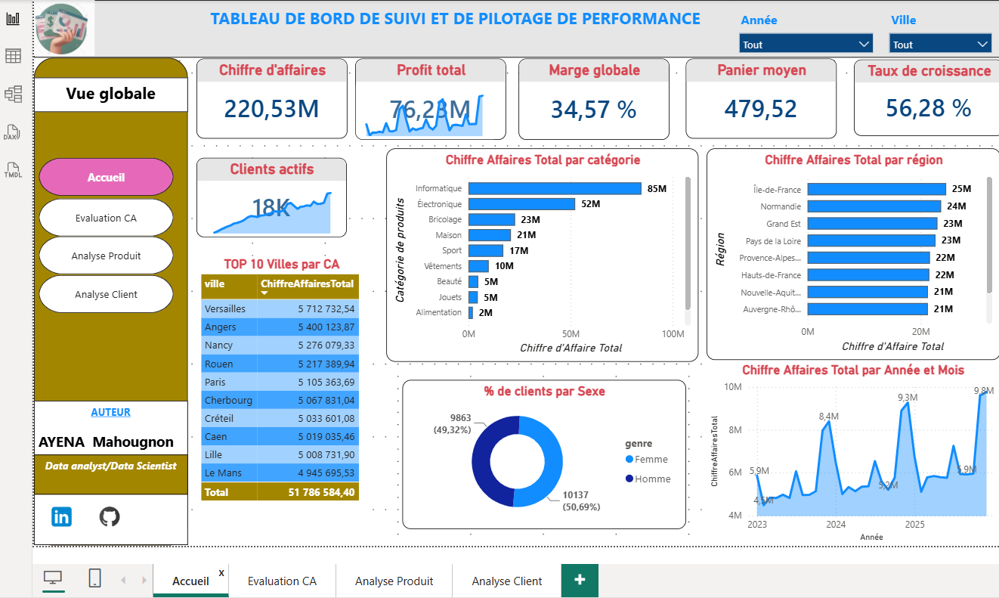
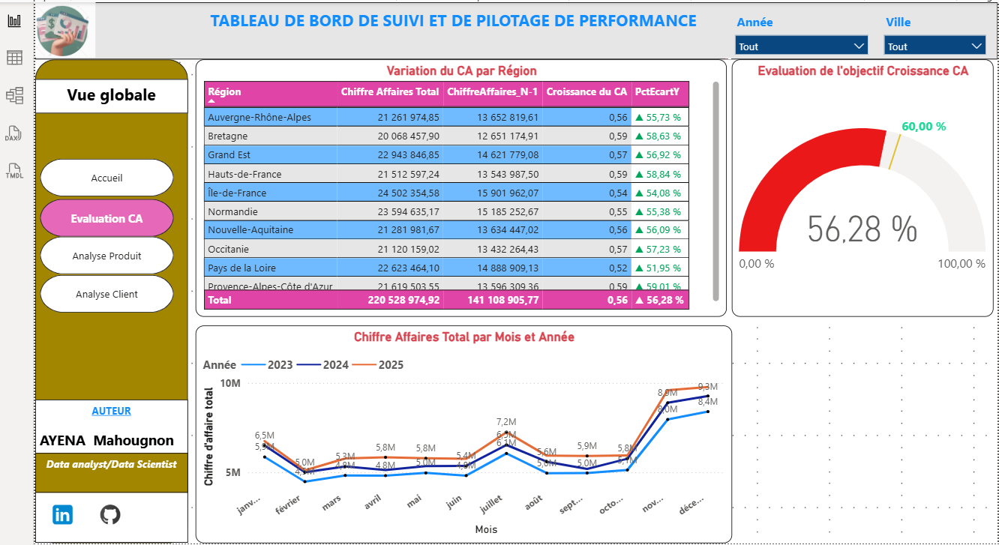
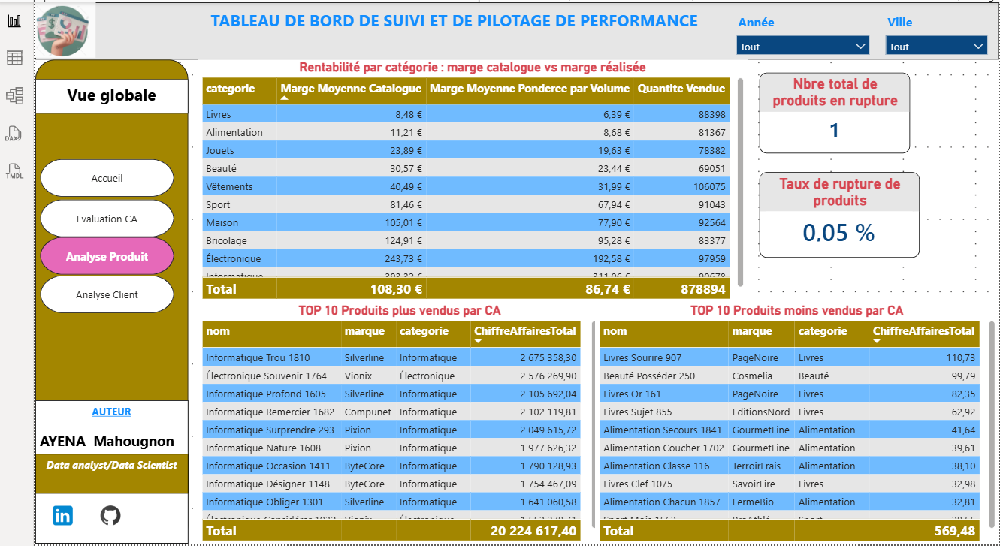
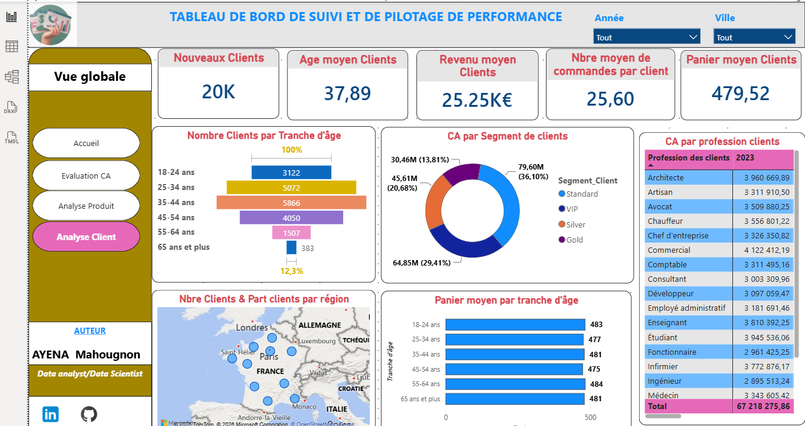

# 📊 Tableau de Bord de Suivi et de Pilotage de Performance

Dashboard interactif développé sous **Power BI Desktop**, permettant le suivi du chiffre d'affaires, de la rentabilité, des produits et du comportement client d'une activité de vente multi-catégories en France (2023-2025).

---

## 🎯 Objectif du projet

Ce dashboard a été conçu pour donner à une direction commerciale une vision à 360° de la performance de l'entreprise : évolution du chiffre d'affaires, rentabilité par catégorie de produits, et profil des clients. Il permet un pilotage rapide grâce à des filtres dynamiques par **Année** et par **Ville**, appliqués sur l'ensemble des 4 pages.

**Données clés du jeu de données :**
- 💰 Chiffre d'affaires total : **220,53 M€**
- 📈 Profit total : **76,28 M€** | Marge globale : **34,57 %**
- 🧺 Panier moyen : **479,52 €**
- 🚀 Taux de croissance : **56,28 %**
- 👥 18 000 clients actifs, répartis sur l'ensemble du territoire français

📥 **[Télécharger le fichier Power BI (Dashbord_vente_N.pbix)](./Dashbord_vente_N.pbix)**  — nécessite [Power BI Desktop](https://www.microsoft.com/fr-fr/power-platform/products/power-bi/downloads) (gratuit) pour être ouvert.

---

## 🗂️ Structure du dashboard

Le rapport comprend **4 pages**, accessibles via un menu de navigation latéral :

| Page | Objectif |
|---|---|
| [🏠 Accueil (Vue globale)](#-page-1--accueil-vue-globale) | Vision synthétique des indicateurs clés de performance |
| [📈 Evaluation CA](#-page-2--evaluation-ca) | Analyse détaillée de la croissance du chiffre d'affaires |
| [📦 Analyse Produit](#-page-3--analyse-produit) | Rentabilité et performance du catalogue produit |
| [🧑‍🤝‍🧑 Analyse Client](#-page-4--analyse-client) | Segmentation et comportement des clients |

---

## 🏠 Page 1 - Accueil (Vue globale)

Page d'entrée du dashboard, elle donne une **photographie instantanée** de la santé globale de l'activité.

- **Cartes KPI** (Chiffre d'affaires, Profit total, Marge globale, Panier moyen, Taux de croissance) : indicateurs de synthèse recalculés dynamiquement selon les filtres Année/Ville sélectionnés.
- **Carte "Clients actifs"** : évolution en mini-graphique (sparkline) du nombre de clients actifs sur la période, avec le total en grand (18K).
- **Chiffre Affaires Total par catégorie** (graphique à barres horizontales) : classe les 10 catégories de produits (Informatique, Électronique, Bricolage…) par contribution au chiffre d'affaires, faisant apparaître l'Informatique et l'Électronique comme catégories dominantes.
- **Chiffre Affaires Total par région** (barres horizontales) : compare la performance commerciale des grandes régions françaises, avec l'Île-de-France en tête.
- **TOP 10 Villes par CA** (tableau) : classement des villes générant le plus de chiffre d'affaires, avec total consolidé.
- **% de clients par Sexe** (donut chart) : répartition Femme/Homme de la base client, quasi équilibrée (49,3 % / 50,7 %).
- **Chiffre Affaires Total par Année et Mois** (courbe temporelle) : met en évidence la saisonnalité des ventes et la tendance haussière entre 2023 et 2025, avec des pics visibles en fin d'année.

---

## 📈 Page 2 - Evaluation CA

Page dédiée au **suivi de la croissance** du chiffre d'affaires dans le temps et par zone géographique.

- **Variation du CA par Région** (tableau comparatif) : confronte le chiffre d'affaires de l'année en cours au chiffre d'affaires N-1 pour chaque région, avec calcul automatique de la croissance en valeur et en pourcentage (colonne PctEcartY), assorti d'indicateurs visuels (flèches de tendance).
- **Evaluation de l'objectif Croissance CA** (jauge / gauge chart) : visualise en un coup d'œil l'atteinte de l'objectif de croissance fixé à 60 %, comparé à la performance réelle (56,28 %) — utile pour un suivi d'objectif en comité de direction.
- **Chiffre Affaires Total par Mois et Année** (graphique linéaire multi-courbes) : superpose les courbes de CA mensuel de 2023, 2024 et 2025, permettant une comparaison directe de la performance d'une année sur l'autre et l'identification des mois les plus forts (traditionnellement novembre-décembre).

---

## 📦 Page 3 - Analyse Produit

Page centrée sur la **rentabilité du catalogue** et l'identification des produits les plus performants.

- **Rentabilité par catégorie : marge catalogue vs marge réalisée** (tableau) : compare pour chaque catégorie la marge théorique affichée au catalogue à la marge réellement pondérée par les volumes vendus, révélant les écarts entre prix affiché et rentabilité effective (remises, promotions, etc.), avec la quantité vendue associée.
- **Cartes "Marge globale"** : synthèse de la marge moyenne en valeur et en pourcentage sur l'ensemble du catalogue.
- **TOP 10 Produits par CA** (tableau détaillé) : liste nominative des produits les plus vendus, avec leur marque, leur catégorie et leur chiffre d'affaires généré — utile pour identifier les références à privilégier dans le réassort ou les campagnes marketing.

---

## 🧑‍🤝‍🧑 Page 4 - Analyse Client

Page consacrée au **profilage et à la segmentation** de la clientèle.

- **Cartes KPI clients** (Nouveaux Clients, Âge moyen, Revenu moyen, Panier moyen) : indicateurs démographiques et comportementaux de la base client.
- **Nombre de Clients par Tranche d'âge** (graphique en entonnoir / funnel) : répartition de la clientèle par tranche d'âge, montrant que le cœur de cible se situe entre 25 et 54 ans.
- **CA par Segment de clients** (donut chart) : ventilation du chiffre d'affaires selon la segmentation commerciale (Standard, Silver, Gold, VIP), mettant en évidence le poids du segment Standard (36 %) et la contribution significative des clients premium.
- **CA par profession des clients** (tableau) : détail du chiffre d'affaires généré par catégorie socio-professionnelle (Architecte, Avocat, Chef d'entreprise, Développeur…), utile pour affiner le ciblage marketing.
- **Nombre de clients & part de clients par région** (carte géographique / map) : visualisation cartographique de la densité de clients sur le territoire français.
- **Panier moyen par tranche d'âge** (barres horizontales) : compare le montant moyen dépensé selon l'âge du client, permettant d'ajuster les offres par segment démographique.

---

## 🛠️ Outils et compétences mobilisés

- **Power BI Desktop** : modélisation des données, création des visuels et mise en page
- **Power Query** : nettoyage et transformation des données sources
- **DAX** : création des mesures (CA, marge, croissance N/N-1, taux, moyennes pondérées)
- **Modélisation de données** : relations entre tables Ventes, Produits, Clients, Régions

---

## 👤 Auteur

**AYENA Mahougnon** — Data Analyst / Data Scientist

